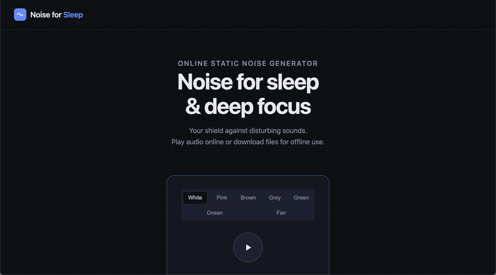
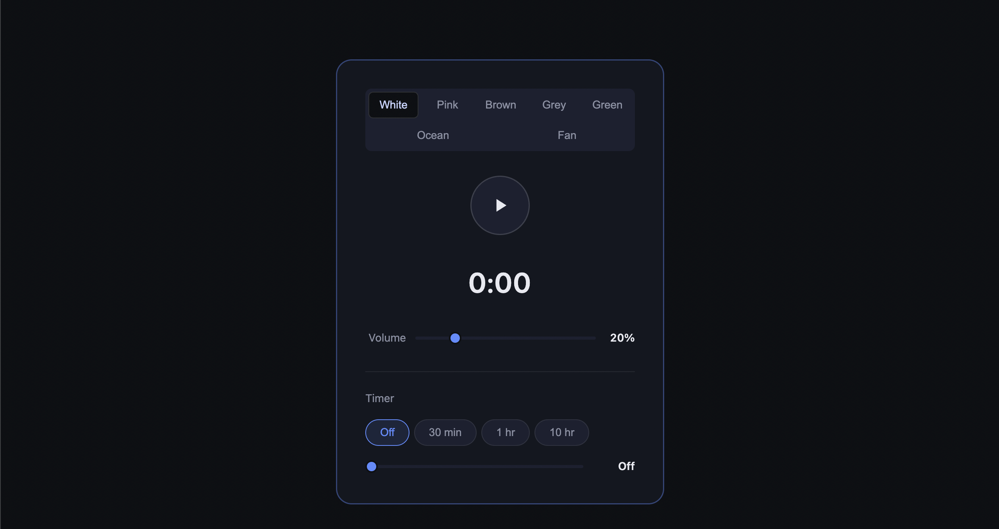
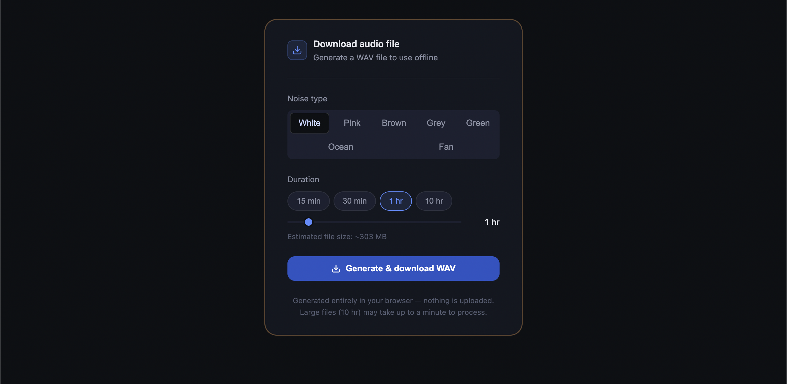

# Online Static Noise Generator
A web based static noise machine to create different colors of static noise on the fly. Static noise is used for sleep, relaxation, focus and ADHD support.

<b>Noise for Sleep</b> 
https://noiseforsleep.com/

- Web based. Built using HTML, CSS and JS.
- Can run from the desktop. Simply download and double click the index.html file to launch.
- Generates static noise on the fly, therefore no looping and no clicking sound to disturb your sleep. 
- Stream audio or generate custom duration WAV audio files for use offline.
- Six noise options - white, pink brown, grey, green, ocean and fan.
- If you want other noise types, simply download this code, then use AI to modify the index.html file to generate the noise type or colour you want.
- Free and Open Source.

 

Minimalist UI

 

Stream Audio

 

Create audio files

 

## Revision History

Version 1.0 
15-June-2026 
First release.

 
